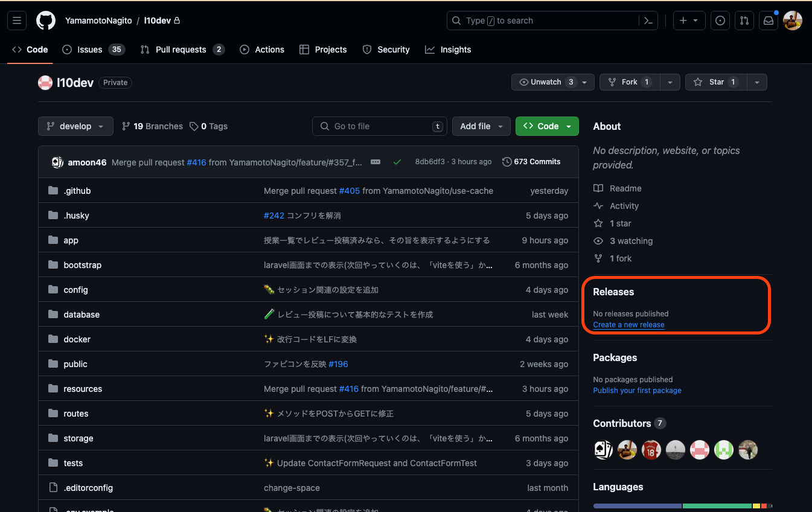
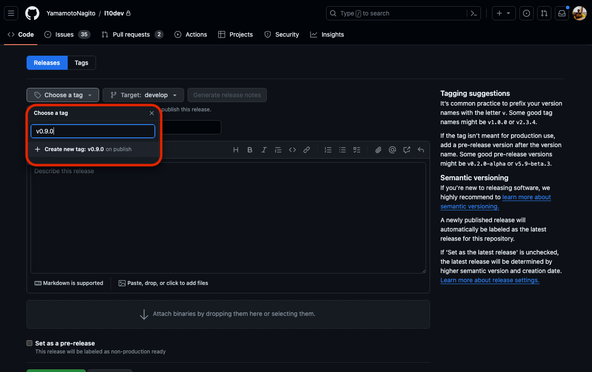
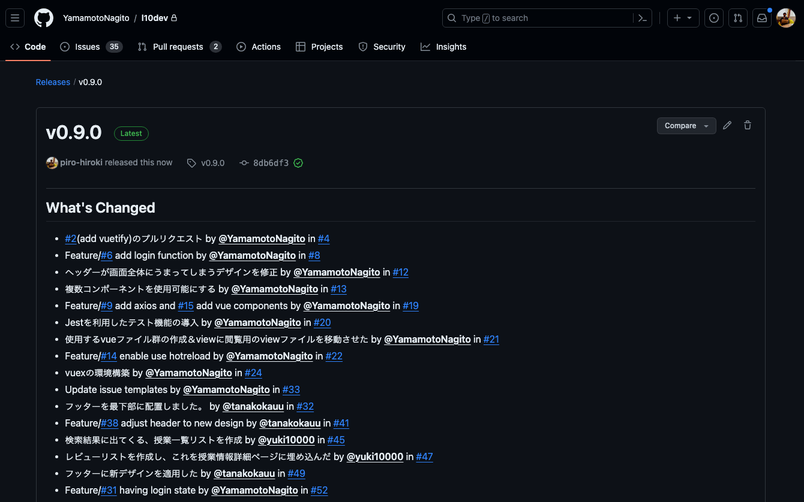
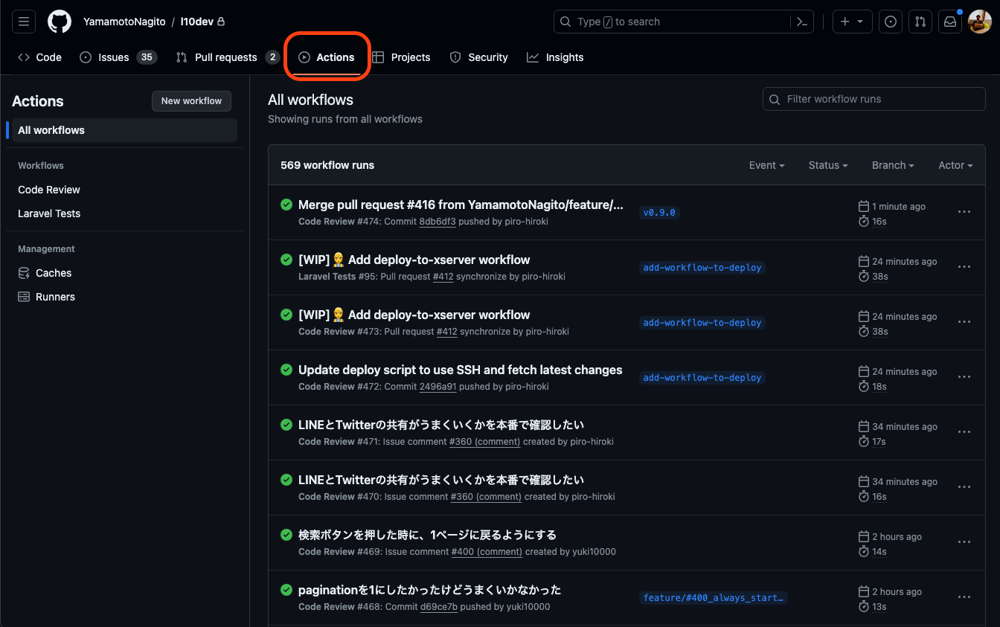

# デプロイ方法

このレポジトリは、GitHub Actionsを利用して、自動的にデプロイされます。
デプロイはタグを切ったタイミングで発火するようにしてあります。

# デプロイ手順

## 1.タグを切る

レポジトリのトップページに移動し、`Releases`タブをクリックします。

## 2.リリース情報を入力

タグ名を入力し、「Create new tag」をクリックし、タグ名を入力します。（Ex. v1.0.0）。
Targetはデフォルトブランチである `develop` を選択します。Release titleはタグ名と同じものを入力します。
リリース内容は書くのが大変なので、「Generate release notes」をクリックし、自動生成されたものをそのまま使います。

## 3.リリースを作成

リリース内容をかけたら、「Publish release」をクリックします。以下のようになれば成功です。

## デプロイの Action が実行されていることを確認

